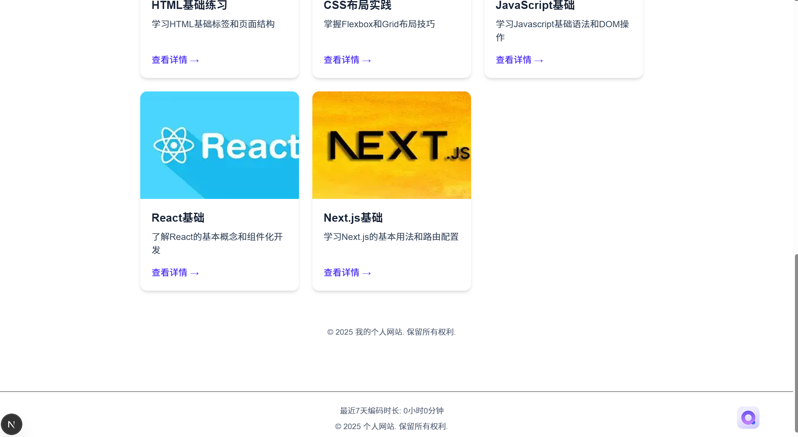
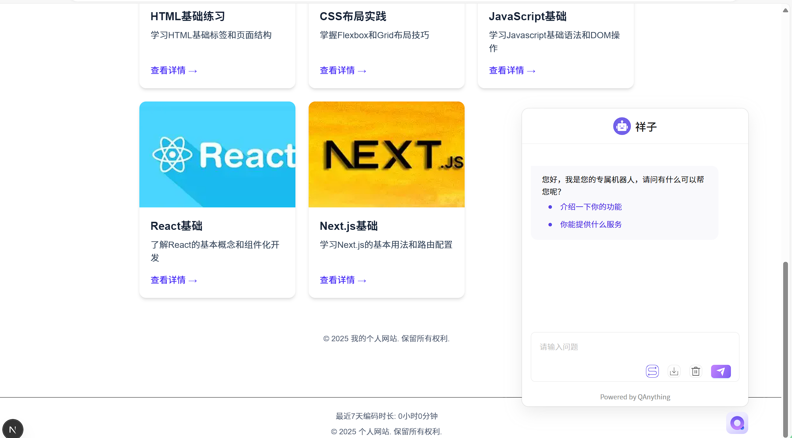
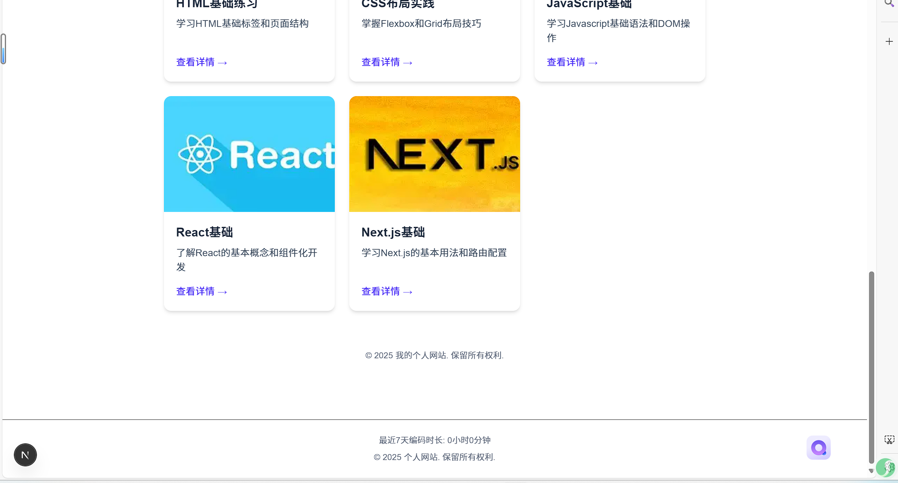
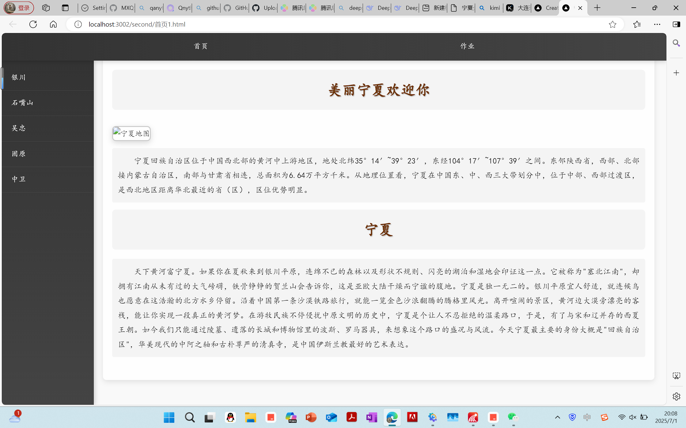
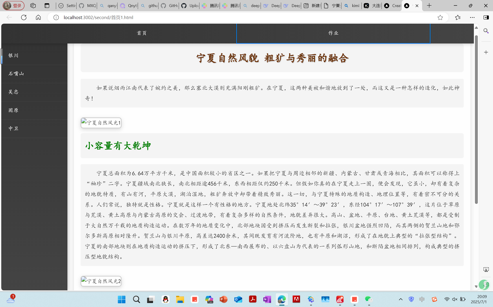
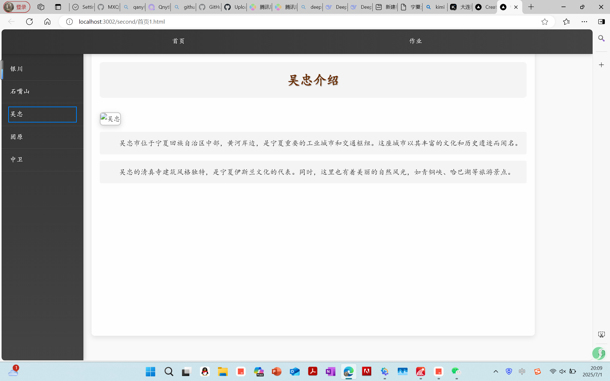

[](https://wakatime.com/@34e5f943-29f8-45bd-8082-cacacecb7285)

This is a [Next.js](https://nextjs.org) project bootstrapped with [`create-next-app`](https://github.com/vercel/next.js/tree/canary/packages/create-next-app).

## Getting Started

First, run the development server:

```bash
npm run dev
# or
yarn dev
# or
pnpm dev
# or
bun dev
```

Open [http://localhost:3000](http://localhost:3000) with your browser to see the result.

You can start editing the page by modifying `app/page.js`. The page auto-updates as you edit the file.

This project uses [`next/font`](https://nextjs.org/docs/app/building-your-application/optimizing/fonts) to automatically optimize and load [Geist](https://vercel.com/font), a new font family for Vercel.

## Learn More

To learn more about Next.js, take a look at the following resources:

- [Next.js Documentation](https://nextjs.org/docs) - learn about Next.js features and API.
- [Learn Next.js](https://nextjs.org/learn) - an interactive Next.js tutorial.

You can check out [the Next.js GitHub repository](https://github.com/vercel/next.js) - your feedback and contributions are welcome!

## Deploy on Vercel

The easiest way to deploy your Next.js app is to use the [Vercel Platform](https://vercel.com/new?utm_medium=default-template&filter=next.js&utm_source=create-next-app&utm_campaign=create-next-app-readme) from the creators of Next.js.

Check out our [Next.js deployment documentation](https://nextjs.org/docs/app/building-your-application/deploying) for more details.
## 运行截图
 







## 项目介绍
作业展示平台 README
项目简介
欢迎来到作业展示平台！这是一个基于 Next.js 构建的现代化 web 应用，旨在为学生提供一个集中展示和分享自己作业成果的数字化空间。平台不仅支持常规的作业展示，还集成了 QAnything 服务以增强内容互动性，并通过 WakaTime API 展示用户的编程活动数据。
QAnything 集成
## 集成路径
该项目选择了通过 API 调用的方式集成 QAnything 服务。我们创建了一个自定义的 API 路由，作为项目后端与 QAnything 服务之间的桥梁。
## 实现细节
路径选择及原因:
我们选择 API 调用方式而非直接嵌入 QAnything 组件，主要是出于以下考虑：
解耦性: API 调用方式使项目前端与 QAnything 服务保持解耦，便于未来替换或升级 QAnything 服务
灵活性: 可以根据项目需求自定义处理 QAnything 的返回数据
安全性: 敏感的 API 密钥可以安全地存储在服务器环境中，避免暴露在客户端
性能控制: 可以在 API 路由中实现缓存策略，减少对 QAnything 服务的频繁调用
WakaTime API 集成方法
获取 API 密钥
注册并登录到 WakaTime 官方网站
进入 "Settings" (设置) 页面
找到 "API Key" 部分，复制您的个人 API 密钥
## 配置项目
在项目根目录下创建 .env.local 文件（如果尚未存在）
添加以下环境变量WAKATIME_API_KEY=your_copied_api_key
API 调用实现：在 app/lib/wakatime.js 中，使用 env 中的 WAKATIME_API_KEY 调用 WakaTime API 获取编程统计信息，包括用户编程时间等数据，供前端展示。
前端展示示例：在 app/components/WakaTimeStats.jsx 中，通过调用 fetchWakaTimeStats 函数获取编程统计信息，并展示在页面上，比如总编程时间等。
Next.js 项目结构：项目根目录下包含 .env.local、.gitignore、next.config.js、package.json 等文件，以及 public 和 src 等文件夹。src 文件夹下的 app 文件夹中包含 components、layouts、pages 和 lib 等子文件夹，分别存放可复用组件、页面布局、页面文件和工具库等。
旧作业整合方式：将旧作业整合到 src/app/assignments 目录下，按年份、学期和课程分组。创建作业数据模型，添加静态作业数据，创建动态路由页面和 API 路由，以展示作业信息。
## 项目运行指南
前置条件：需要安装 Node.js（推荐 v18.0.0 或更高版本）、npm（推荐 v8.0.0 或更高版本）或 yarn，以及 Git。
安装依赖：在项目根目录打开终端，运行 npm install 或 yarn install。
环境变量配置：创建 .env.local 文件，添加 QANYTHING_API_KEY 和 WAKATIME_API_KEY 等环境变量。
开发模式：运行 npm run dev 或 yarn dev 启动开发服务器，然后在浏览器打开 http://localhost:3002 访问应用。
构建生产版本：运行 npm run build 或 yarn build 构建项目，验证生产构建可运行 npm run start 或 yarn start。
部署到生产环境：将构建后的文件部署到 web 服务器，推荐使用 Vercel、Netlify 或 GitHub Pages 等服务。